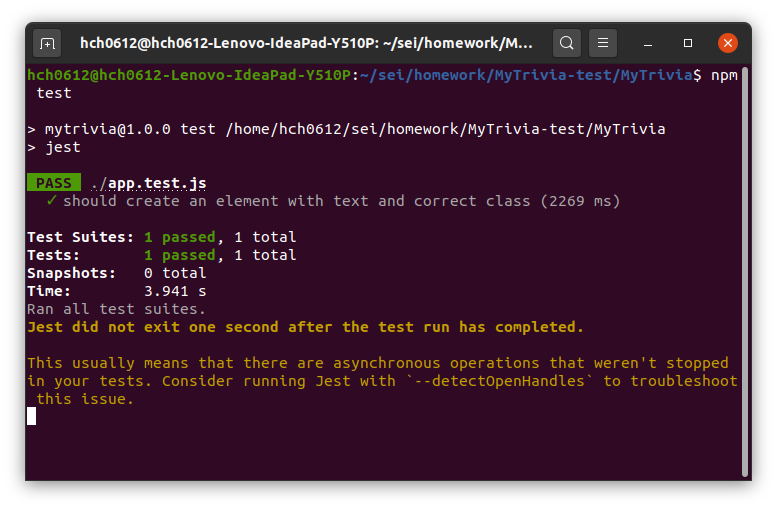

# MyTrivia
[Live Demo](https://huangca.github.io/MyTrivia/)

## HTML/CSS,JavaScript and  Bootstrap
I choose to do a Trivia web application because web application is the most easy way to showcase the project. The only thing you need just a browser. No need to additional setup, click on the live demo link to play the game. 

## UI

* Question:Show the question
* Answers:Have 3 or 4 choices,click the answer you think is right.
* Timer:For each question, player have 15 second to make a choice. Run out of time will be considered as click a wrong answer.
* Process:10 questions for a round. The process bar show how many questions left, how many answer right and how many question answer wrong
* Magic skills: Player have two magic skill for each round game. Skip will let player skip a question don't know the answer. 50/50 will let just 1 right answer and 1 wrong answer stay, others will be remove.

Player will know the choice right or wrong immediately, the timer will stop until the player click next button.

## Jest and Puppeteer for test

I use end to end(e2e) total random test. Cause the logic of this project is all about DOM, it is hard to do the unit testing. So I choise total random test to test this project. I write a test program randomly do all all possible operations and run it multiple time. It maybe not get good code coverage for each time test, but run it multiple time can make up this weakness and test the stability. 

## Code Challenge Form Tandem
This project is code challenge topic form Tandem. All the questions from a given JSON file. I try to read this file without modify so you can see I do a asynchronous call when at the code.
